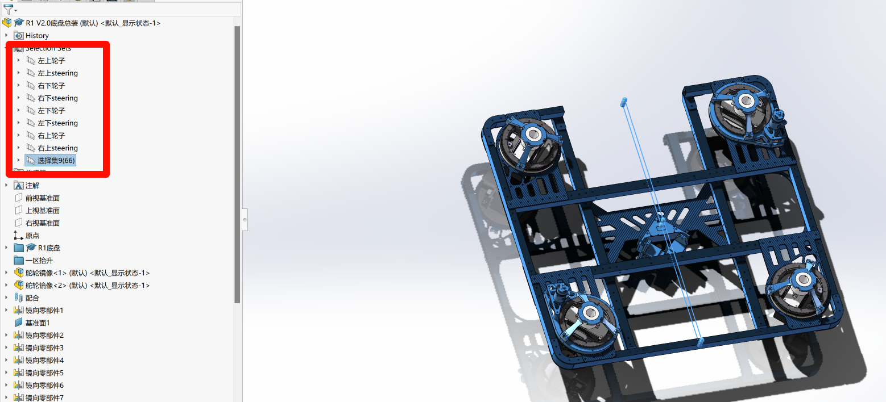
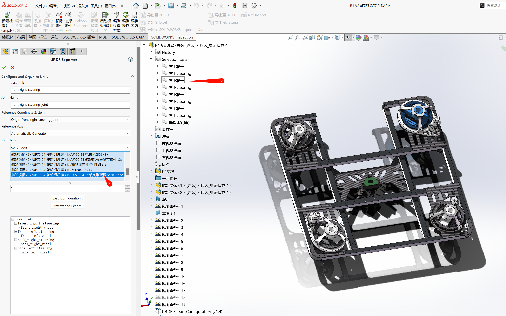
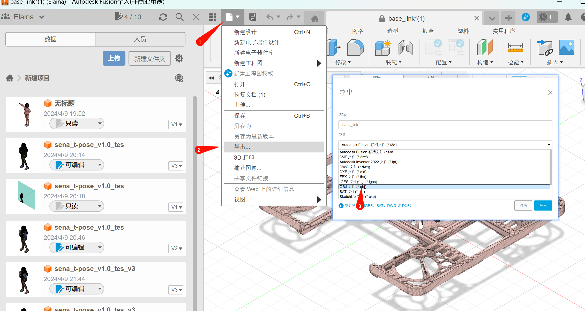
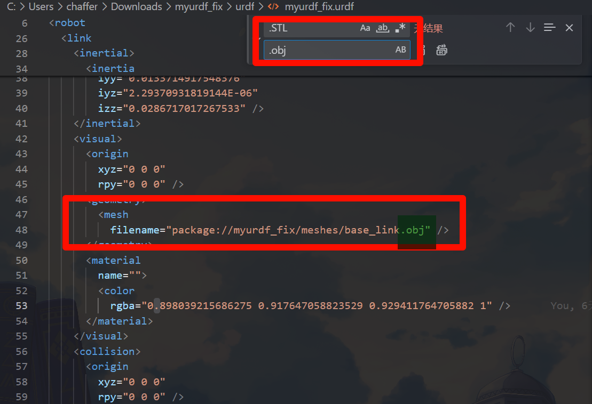

<!--
 * @Author: Elaina
 * @Date: 2024-10-11 14:42:36
 * @LastEditors: chaffer-cold 1463967532@qq.com
 * @LastEditTime: 2024-10-11 15:17:16
 * @FilePath: \undefinedc:\Users\chaffer\Downloads\底盘 (1)\README.md
 * @Description: 
 * 
 * Copyright (c) 2024 by ${git_name_email}, All Rights Reserved. 
-->
# 导入urdf的方式 *[参考链接](https://blog.csdn.net/weixin_42899627/article/details/141901240?ops_request_misc=%257B%2522request%255Fid%2522%253A%25220FF56AE8-832F-4F28-90D1-5B9F1D9D2F73%2522%252C%2522scm%2522%253A%252220140713.130102334..%2522%257D&request_id=0FF56AE8-832F-4F28-90D1-5B9F1D9D2F73&biz_id=0&utm_medium=distribute.pc_search_result.none-task-blog-2~all~sobaiduend~default-1-141901240-null-null.142^v100^pc_search_result_base5&utm_term=solidworks%20urdf&spm=1018.2226.3001.4187)*
## 1.先在SLDPRT中把轴对应部分加入选集  

*具体的方法不赘述了*
## 2.按照参考链接设置轴或者坐标系
## 3.在urdf插件中绑定轴时候直接选择选集

## 4.当导出后处理STL文件
### 将STL文间拖入Auto Fusion中并导出为obj文件

## 5.更改URDF文件
### 将导出的obj文件放入mesh文件夹 然后用vscode打开urdf文件，查找替换其中的.STL为.obj

### 正常会把绿框部分替换了，之前替换过不做演示 

# 重要提示
## 1.当你导出的urdf在rviz中乱动的时候先检查自己的选集是否正确，没问题则去看配合是否紧密
## 2.按照这个流程导出的urdf是没有材质的
### [github传大文件教程](https://blog.csdn.net/wzk4869/article/details/131661472)